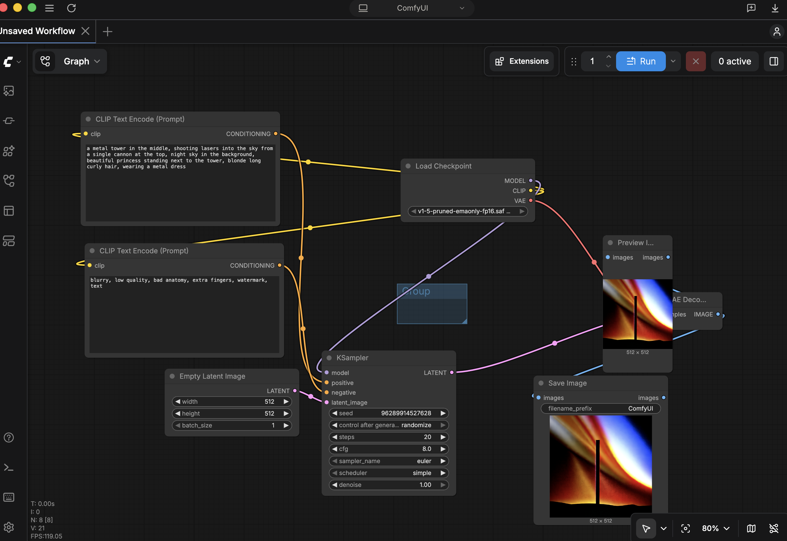
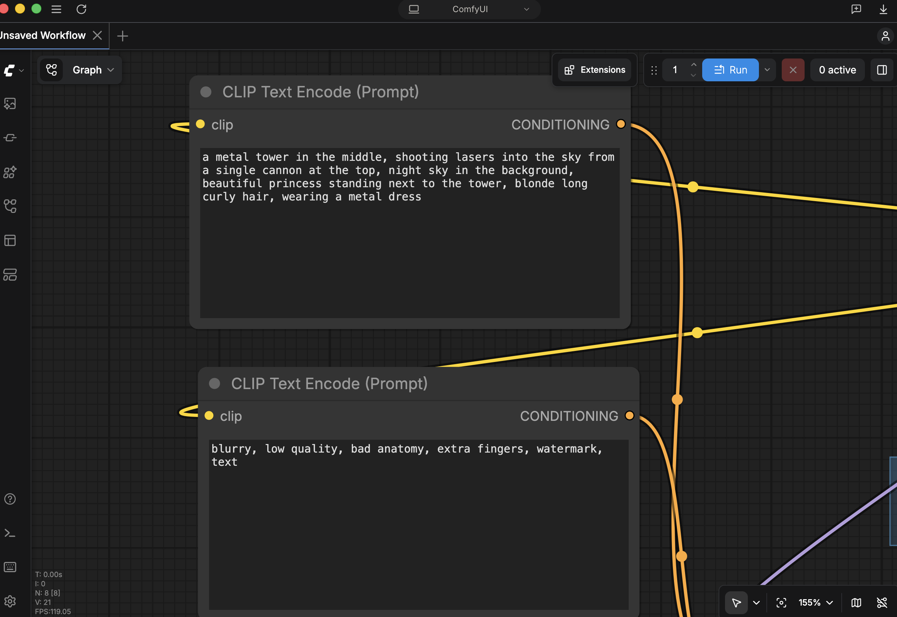
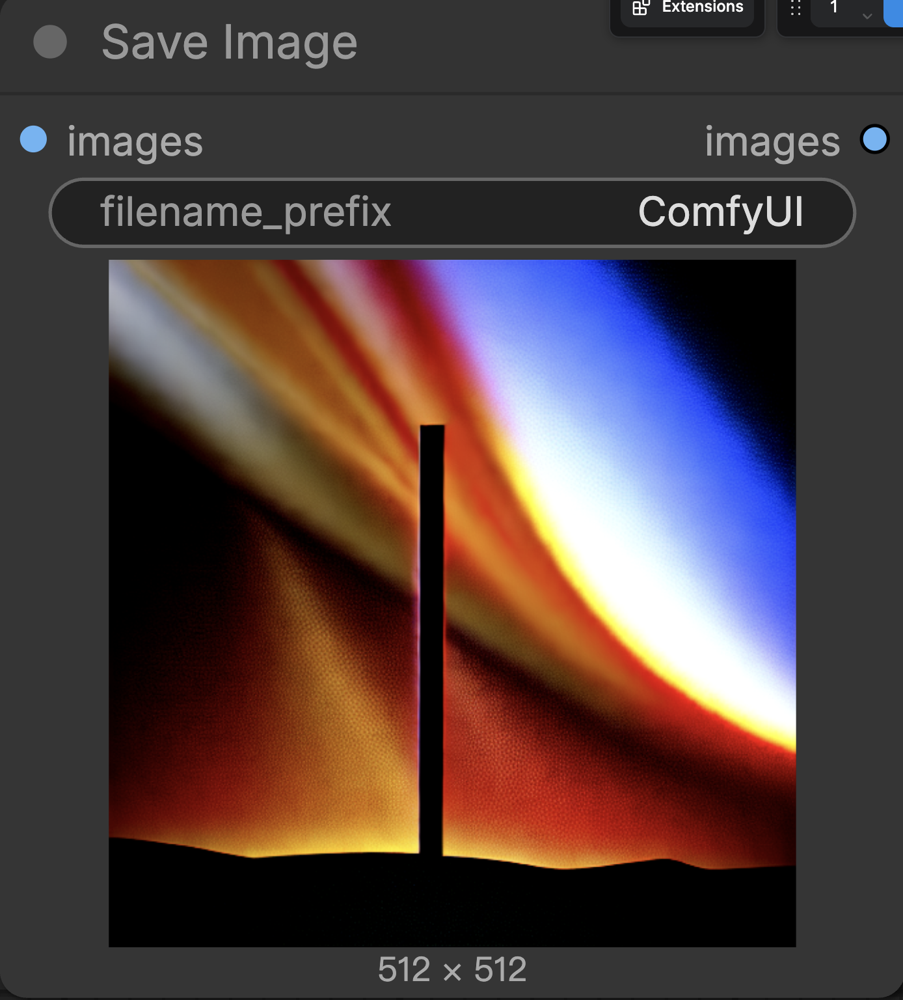

# My First ComfyUI Project

## Running Locally

For projects with media files, use a local server:

```bash
python -m http.server 8000
```

or

```bash
npx http-server
```

---

## Process

1. Opened ComfyUI Desktop.
2. Downloaded and loaded a Stable Diffusion checkpoint model.
3. Added the basic nodes:
   - Load Checkpoint
   - CLIP Text Encode (Positive Prompt)
   - CLIP Text Encode (Negative Prompt)
   - Empty Latent Image
   - KSampler
   - VAE Decode
   - Preview Image
   - Save Image
4. Connected all the nodes in the correct order.
5. Wrote a positive prompt and a negative prompt.
6. Clicked **Run** to generate the image.
7. Saved the generated result.

---

## Prompt

### Positive Prompt

```
a metal tower in the middle, shooting lasers into the sky from a single cannon at the top, night sky in the background, beautiful princess standing next to the tower, blonde long curly hair, wearing a metal dress
```

### Negative Prompt

```
blurry, low quality, bad anatomy, extra fingers, watermark
```

---

## Result





---

## Reflection

This was my first time using ComfyUI, so I spent some time learning how each node works and how to connect them correctly. At first I made several mistakes with the workflow, but after fixing the connections I was able to generate my first image successfully. Although the result did not completely match what I imagined, I learned the basic workflow of AI image generation and gained a better understanding of how prompts and different nodes affect the final output.