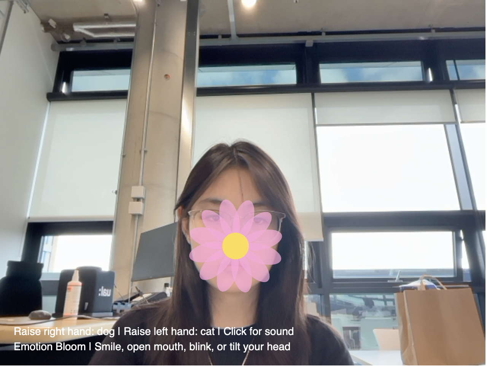

# 🌸 Emotion Bloom

# Emotion Bloom

## Project Overview

Emotion Bloom is an interactive project made with p5.js and ml5.js. It uses the webcam to detect my face and hand movements. Different facial expressions and gestures create different flowers and animals on the screen. I wanted to make something playful that lets people interact with flowers in a simple and fun way.

---

## Idea

I think flowers can represent different emotions, so I wanted to connect facial expressions with different flower designs. For example, smiling creates a sunflower, opening the mouth creates a blue flower, and blinking or tilting the head changes the flower into another style. After finishing the face interaction, I felt the project was still a little simple, so I added hand tracking. Raising the right hand creates a dog and raising the left hand creates a cat. They follow the user's hand, which makes the interaction feel more interesting.

---

## Features

* Face tracking with ml5.js FaceMesh
* Hand tracking with ml5.js HandPose
* Different flowers for different facial expressions
* Smile → Sunflower
* Open mouth → Blue flower
* Left blink → Long petal flower
* Right blink → Round flower
* Head tilt → Wind flower
* Raise the right hand → Dog follows the hand
* Raise the left hand → Cat follows the hand
* Floating particle background
* Simple background sound

---

## Tools

* p5.js
* ml5.js
* JavaScript
* VS Code
* GitHub

---

## Interaction

| User Action      | Result                     |
| ---------------- | -------------------------- |
| Smile            | Sunflower appears          |
| Open mouth       | Blue flower grows          |
| Blink left eye   | Long petal flower          |
| Blink right eye  | Round flower               |
| Tilt head        | Wind flower appears        |
| Raise right hand | Dog follows the hand       |
| Raise left hand  | Cat follows the hand       |
| Click the mouse  | Start the background sound |

---

## Process

I first made the face tracking and connected different facial expressions to different flowers. Then I changed the colours, shapes and animations to make each flower look different. After that, I added hand tracking because I wanted people to interact with more than just their face. Finally, I added the background particles and sound to make the whole scene feel calmer and more alive.

---

## Challenges

The hardest part was using FaceMesh and HandPose together. At first, the tracking was not very stable, and the left and right hands were sometimes mixed up because the webcam image is mirrored. I tested the project many times and adjusted the code until everything worked correctly.

---

## Screenshot

## Reflection

This project helped me learn more about creative coding and machine learning. Before this, I mostly made simple interactive sketches, but this project let me combine face tracking, hand tracking, animation and sound together. If I continue working on it, I would like to add more flowers, more animals and different backgrounds so the interaction feels even richer.
