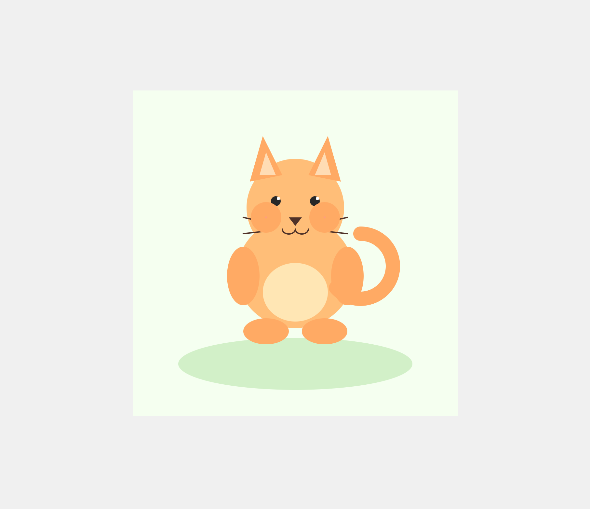
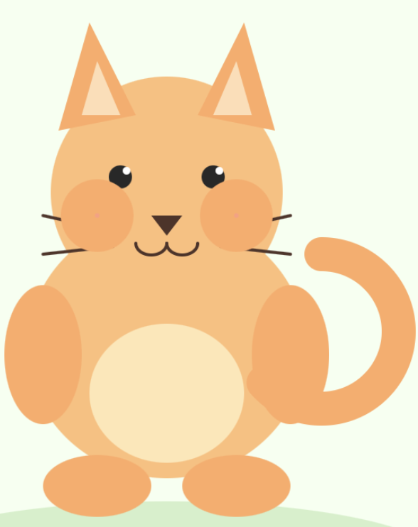

# 2

## Getting Started

Open `index.html` in your web browser and start editing `sketch.js`.

## Running Locally

For projects with media files, use a local server:

```bash
# Using Python
python -m http.server 8000

# Using Node.js
npx http-server

# Using VS Code Live Server extension
# Right-click index.html -> "Open with Live Server"
```

## Resources

- [p5.js 2.0](https://beta.p5js.org/)
- [p5.js Reference](https://p5js.org/reference/)



### Reflection

Today I created a simple cat using basic shapes in p5.js. I used circles, ellipses, and triangles to build the body and face. I also added soft colors to make the cat look cute and friendly. This project helped me understand how simple geometric shapes can be combined to create a complete character.